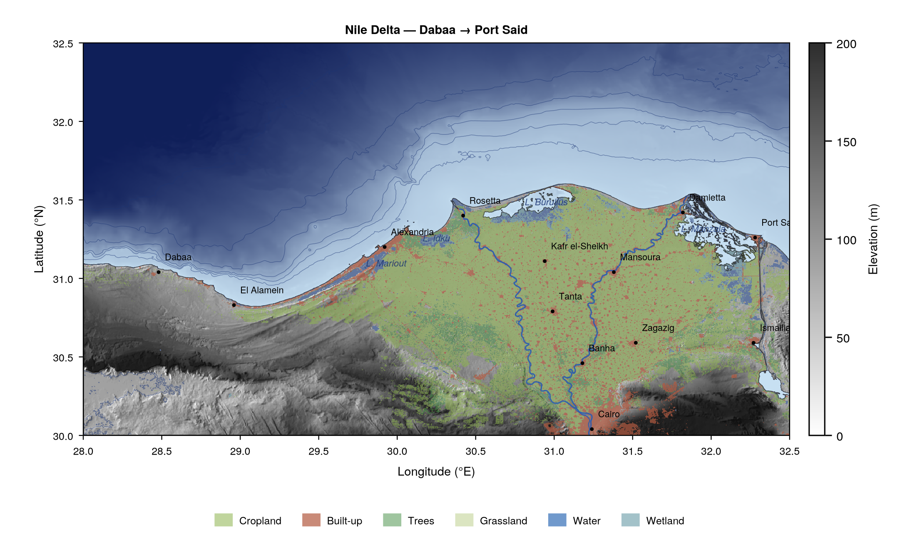

# NileDeltaBase.jl

Priority-stacked DEM access layer for the Nile Delta, Egypt. Pattern and API
mirror [GulfBase.jl](https://github.com/arateb/GulfBase.jl).



_Shaded-relief + ESA WorldCover + GMRT bathymetry. Cropland (olive-green),
built-up (brown), trees/wetland (green/cyan), Mediterranean depth ramp with
50/100/200/500/1000 m isobaths. Inland lagoons (Manzala, Burullus, Idku,
Mariout) shown as shallow water._

## Coverage

Core bbox: **29.0–35.1°E, 29.3–31.8°N** (~680 km × 275 km, ~187,000 km²).
Extended display bbox: **28.0–32.5°E, 30.0–32.5°N** (Dabaa → Herodotus basin).

Covers Cairo (south) → Mediterranean (north), and Alexandria / west-Nubaria
(west) → Taba at the Gulf of Aqaba (east). Includes the Nile Delta, the
Suez Canal corridor, the entire north Sinai Peninsula (Bardawil Lagoon,
El Arish, Rafah), and offshore bathymetry across the Herodotus basin and
Nile cone.

## Layer stack (low → high priority, last wins)

| Layer | Res | Source | Status |
|-------|----:|--------|--------|
| `gmrt`      | ~100 m topo+bathy | GMRT (LDEO, multibeam + SRTM fallback) | ingested |
| `cop_glo30` | 30 m DSM          | Copernicus GLO-30 (AWS Open Data) | ingested |
| `fabdem`    | 30 m bare-earth   | FABDEM v1.2 (U. Bristol) | ingested |
| `deltadtm`  | 30 m coastal DTM  | DeltaDTM v1.1 (Pronk et al. 2024) | ingested |
| `tandemx12` | 12 m DSM          | TanDEM-X (DLR science proposal) | pending |

Fused VRTs: `fused_30m` (default), `fused_12m` (future).

## Setup

```julia
using NileDeltaBase
NileDeltaBase.set_root!("/data4/EGY/NileDeltaBase")
# or set ENV["NILEDELTABASE_ROOT"]
```

## Quick start

```julia
h = sample_elevation(:fused_30m, 31.25, 30.05)    # Cairo, ~22 m
data, lons, lats = extract_frame(:delta_asc_058A, :fused_30m)

src, lons, lats = resolution_source_map()
# 1=GMRT, 2=GLO30, 3=FABDEM, 4=DeltaDTM, 5=TanDEM-X

for (name, hs) in pairs(HOTSPOTS)
    h = sample_elevation(:fused_30m, mean(hs.lon), mean(hs.lat))
    @info "$name: $h m ($(hs.desc))"
end
```

## Vertical datum

All 30 m sources ship in EGM2008 orthometric heights. No datum conversion is
applied inside the package. For InSAR DEM-error correction this is the
correct reference.

## Dependencies

GDAL ≥ 3.0 on PATH (`gdalbuildvrt`, `gdalwarp`, `gdallocationinfo`,
`gdal_translate`, `gdalinfo`). No Julia geospatial packages required.

## Data staging

Raw tiles and VRTs live outside the package at the project root:

```
$NILEDELTABASE_ROOT/
  data/raw/{cop_glo30,fabdem,deltadtm,bathymetry,tandemx12,shoreline,worldcover}/
  data/vrt/
  data/derived/{display,hydro}/
  results/
  logs/
```

Ingest scripts are in `scripts/` (`S01_*` download, `S02_*` fuse,
`S03_*` derived products).
